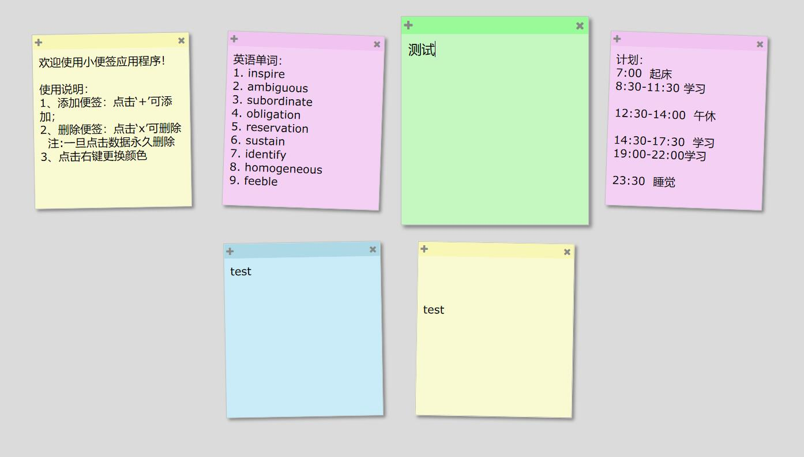

## 实现内容及方法：

1. 在便签内随意输入、删除文本： **idea**：多行文本框`<textarea>`标签实现；
2. 浏览器永久存储便签内容： **idea**：为文本框绑定失去焦点事件，通过web本地存储API`localStorage`，存储文本内容；
3. 删除便签： **idea**：为删除item`X`绑定点击事件，删除便签DOM和该DOM本地存储相关内容；
4. 添加便签： **idea**：为添加item`+`绑定点击事件，建立便签DOM节点，设置其id为唯一值key；
5. 改变便签颜色： **idea**：首先阻止上下文菜单默认行为，然后为便签绑定`contextmenu`事件，在便签区域点击鼠标右键，弹出选项菜单，点击颜色，设置便签颜色。
6. 浏览器打开“小便签应用”链接，自动加载本地存储内容；如果本地存储便签数量为零，自动加载”使用说明小便签“。

## 线上演示地址
点击：[http://139.199.80.224/stickynote/stickynote.html](http://139.199.80.224/stickynote/stickynote.html)

## 效果图：

